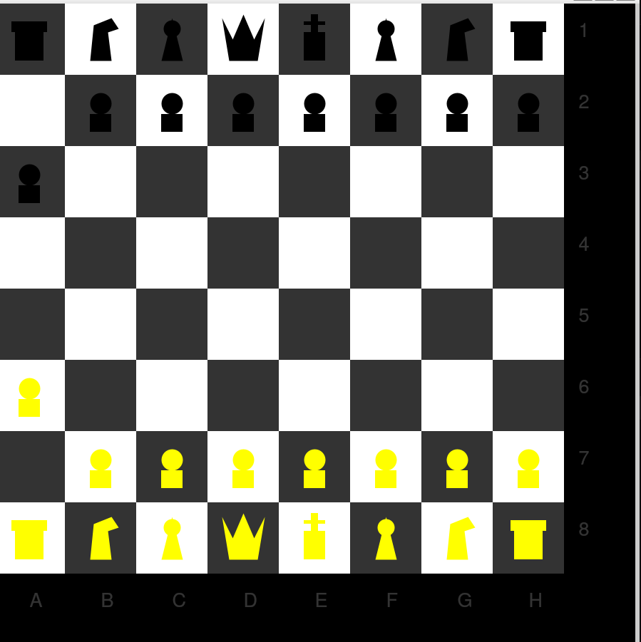

# chess
# ♟️ Chess Game in Python — with `qtido`

> Python project — two-player chess game with a graphical interface and move validation.

🚧 **Project status: nearly complete — fully playable and open for improvement.**

---

## Table of Contents

- [What the project does](#what-the-project-does)
- [What you need to install](#what-you-need-to-install)
- [How to install and run](#how-to-install-and-run)
- [How to play](#how-to-play)
- [How the code works](#how-the-code-works)
- [Known limitations](#known-limitations)

---

## What the project does



This project is a fully playable two-player chess game written entirely in Python. It features a real graphical window where the board and pieces are displayed, while players enter their moves in the terminal.

What makes this project interesting is that **every single piece is drawn from scratch** using only basic shapes — circles, rectangles and polygons. There is no image file, no sprite, no external asset. The board, the pawns, the queen, the king — all of it is generated by the code itself.

The game also includes a **complete move validation system**: it checks that the piece belongs to the right player, that the destination is inside the board, that you are not capturing your own piece, and that the move follows the actual rules of chess for each piece type.

- **White pieces** are drawn in **yellow**
- **Black pieces** are drawn in **black**
- Columns are labelled **A to H**, rows **1 to 8**

---

## What you need to install

### Python

You need Python **3.10 or higher** because the code uses `match/case`, a feature added in Python 3.10.

### `qtido`

`qtido` is an educational Python library with simple, French-named functions designed for learning programming.

> ⚠️ `qtido` is **not** based on Python's `turtle` library. It is built on top of **PyQt5**, which is a Python interface for the Qt graphics framework. Qt is what opens the window and draws the shapes. The name "qtido" comes from **Qt** (the graphics tool underneath) and **ido** (a universal language).

### `numpy`

Used for one single function: `logical_xor`. This checks that a rook moves in a straight line — either horizontally or vertically, but never both at the same time.

---

## How to install and run

### Step 1 — Create a virtual environment

A virtual environment keeps all the libraries for this project in one place, separate from the rest of your computer. It is the proper way to manage dependencies.

```bash
# Go to your project folder
cd path/to/your/project

# Create the virtual environment
python3 -m venv venv

# Activate it
# On Linux / macOS:
source venv/bin/activate

# On Windows (PowerShell):
venv\Scripts\Activate.ps1

# On Windows (cmd):
venv\Scripts\activate.bat
```

> Once activated, you will see `(venv)` at the start of your terminal line. Everything you install with `pip` stays inside this environment only.

### Step 2 — Install the libraries

```bash
# PyQt5 first — qtido needs it to work
pip install pyqt5

# Then qtido
pip install qtido

# Then numpy
pip install numpy
```

> 💡 On Linux you can also use:
> ```bash
> sudo apt install python3-pyqt5 python3-numpy
> ```

### Step 3 — Check that everything is installed

```bash
python3 -c "from qtido import *; print('qtido OK')"
python3 -c "import numpy; print('numpy OK')"
```

### Step 4 — Run the game

```bash
python3 echecs_chess.py
```

The graphical window opens automatically. You play by typing in the terminal.

---

## How to play

### Square codes

Each square has a letter for the column (A to H) and a number for the row (1 to 8):

```
     A    B    C    D    E    F    G    H
  ┌────┬────┬────┬────┬────┬────┬────┬────┐
8 │ ♜  │ ♞  │ ♝  │ ♛  │ ♚  │ ♝  │ ♞  │ ♜  │  ← Black pieces
7 │ ♟  │ ♟  │ ♟  │ ♟  │ ♟  │ ♟  │ ♟  │ ♟  │
  │    │    │    │    │    │    │    │    │
  │    │    │    │    │    │    │    │    │
  │    │    │    │    │    │    │    │    │
  │    │    │    │    │    │    │    │    │
2 │ ♙  │ ♙  │ ♙  │ ♙  │ ♙  │ ♙  │ ♙  │ ♙  │
1 │ ♖  │ ♘  │ ♗  │ ♔  │ ♕  │ ♗  │ ♘  │ ♖  │  ← White pieces
  └────┴────┴────┴────┴────┴────┴────┴────┘
```

### Each turn

1. The terminal tells you whose turn it is — **WHITE** or **BLACK**
2. Type the square of the piece you want to move (example: `E2`)
3. Type the square where you want to move it (example: `E4`)
4. If the move is not allowed, the game tells you and asks you to try again
5. The board updates in the window after every valid move
6. At the end of each round, the game asks if you want to keep playing

```
C'est au tour du joueur BLANC tes pions sont en ligne 7 :
Quel est le code de la pièce à déplacer ? E7
Quel est le code de la case destinataire ? E5
```

---

## How the code works

### Drawing the board

The board is drawn by going through all 64 squares with two nested loops. Each square is coloured white or dark grey depending on whether the sum of its row and column index is even or odd — that is what creates the classic checkerboard pattern.

### Drawing the pieces

Each piece has its own drawing function, built entirely from basic shapes:

| Function | Piece | Shapes used |
|---|---|---|
| `tracer_pion` | Pawn | circle (head) + rectangle (body) |
| `tracer_tour` | Rook | 2 stacked rectangles |
| `tracer_fou` | Bishop | circle + triangle |
| `tracer_chevalier` | Knight | 6-point polygon (horse head shape) |
| `tracer_reine` | Queen | 7-point crown polygon |
| `tracer_roi` | King | rectangle + cross made of 3 rectangles |

The function `dessiner()` reads the piece name (e.g. `"reine-B"`) and calls the right drawing function automatically.

### How the board is stored in memory

The board is stored as a list of 8 lists, each containing 8 strings. Each string is either a piece name like `"pion-B"` or an empty string `""` for an empty square.

```python
[
  ["tour-N", "chevalier-N", "fou-N", "reine-N", "roi-N", ...],  # row 8 — Black back row
  ["pion-N", "pion-N", "pion-N", ...],                          # row 7 — Black pawns
  ["", "", "", "", "", "", "", ""],                              # empty rows
  ...
  ["pion-B", "pion-B", "pion-B", ...],                          # row 2 — White pawns
  ["tour-B", "chevalier-B", "fou-B", "roi-B", "reine-B", ...],  # row 1 — White back row
]
```

- `-B` = White piece (Blanc)
- `-N` = Black piece (Noir)

### Converting square codes to array positions

`de_code_a_num_case("E4")` converts a square code into `[row, col]` indices:
- Row: `int("4") - 1 = 3`
- Column: `ord("E") - ord("A") = 4`

### How moves are validated

Before any move is made, `checker_le_move()` runs through these checks in order:

1. The starting square is not empty
2. The player is not trying to capture their own piece
3. The square codes are valid and inside the board
4. The piece belongs to the current player
5. The move follows the specific rules for that piece type

Movement rules per piece:

| Piece | Rule |
|---|---|
| Rook | Same row or same column only (XOR — not both) |
| Bishop | Diagonal only — column gap must equal row gap |
| Knight | L-shape — offsets of (2,1) or (1,2) |
| King | 1 square in any direction |
| Queen | Rook + Bishop combined |
| White Pawn | Moves up (row decreases), diagonal capture, double step from row 6 |
| Black Pawn | Moves down (row increases), diagonal capture, double step from row 1 |

---

## Known limitations

The game is fully playable but some chess rules have not been implemented yet. These are honest and expected gaps for a first version of this kind of project.

**✅ What already works**
- All 6 piece types move according to their rules
- Capturing opponent pieces
- Pawn double step from the starting row
- Players take turns correctly
- The board refreshes visually after every move
- Invalid moves are rejected with an error message
- The game keeps running until players decide to stop

**❌ What is not yet implemented**

- **Check and checkmate** — the game does not detect when a king is in check. A player can ignore a check and keep playing freely, which is not allowed in real chess.

- **Pieces blocking the path** — rooks, bishops and queens can currently move through other pieces. In real chess, a piece cannot jump over another one (except the knight). Fixing this would require checking every square along the path between the start and the destination.

- **Castling** — the special move where the king and a rook swap positions has not been implemented.

- **En passant** — the special pawn capture rule that applies right after an opponent's double step has not been implemented.

- **Pawn promotion** — when a pawn reaches the last row, it should become a queen (or another piece). Right now it stays a pawn.

- **Input error handling** — if a player types something invalid like `"Z9"` or just presses Enter, the program will crash. Adding a simple check on the input format would fix this.

- **Game over condition** — the game only stops when a player manually types `non`. There is no automatic end when a king is captured.

---

## Deactivate the venv when you are done

```bash
deactivate
```
